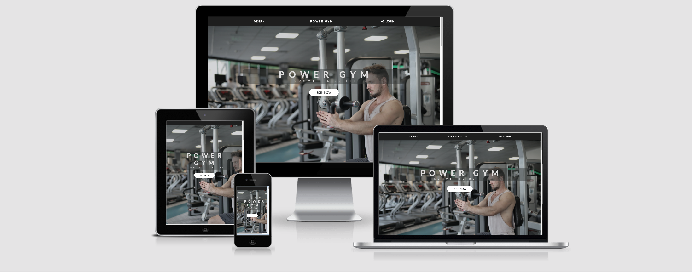

# Power Gym

---

## Description
> The main purpose of this project was to build a website for my First Milestone Project as a part of the Full Stack Web Developer Diploma course, using knowledge of HTML and CSS. I have decided to build a website for a fictional gym called Power Gym.

---

### Table of Contents

- [Description](#description)
- [UX](#UX)
- [Strategy](#Strategy)
- [Scope](#Scope)
- [Structure](#Structure)
- [Skeleton](#Skeleton)
- [Surface](#Surface)
- [Technologies Used](#Technologies-Used)
- [Testing](#Testing)
- [Deployment](#Deployment)
- [Credits](#Credits)
- [Acknowledgements](#Acknowledgements)

---
# UX

## Strategy

The website should be easy to navigate and should encourage the user to explore all the sections of the main page to learn more about what the gym has to offer. The site should be simple and bright, which will be accomplished by using white, light grey and dark grey colours.

---

## User Stories

### First time user
  As a first time user,
* I want to be able to  navigate through the site easily to find information.
* I want to quickly establish what services the gym offers.
* I want to be able to read reviews left by existing gym members.
* I want to be able to establish if the gym is clean and safe and if any measures have been taken in terms of social distancing.
* I want to be able to easily sign up/sign in as a member.
* I want to be able to follow the gym on various social media platforms for workout videos and tips.
* I want the website to be responsive so I can view it on my mobile phone.

### Returning User
  As a returning user,
* I want to check if there are any new classes or training sessions.
* I want to book online classes or join training classes at the gym.
* I want to contact the gym to find out more information about their services.

---

## Scope 

### Features
- The website has a sticky navigation, which will allow the user to navigate easily throughout the different sections.
- The user can click the "PowerGym" logo on the sticky navigation to go back to the start(top) of the page.
- The user can click the "Join Us" button below the main heading of the page to access a signup form.
- The user can click the "Menu" button to access a dropdown menu.
- The user can click the "Log In" button to access a pop up login form.
- The user can click the "Contact Us" button in the dropdown menu to access a contact form, where they can get in touch with the gym.
- They also have an option to contact the gym through the form located on the bottom of the page above the social links section or by clicking "Contact Us" link in the footer.
- "Find a Gym" button provides an easy way to find out where their local gym is located.
- "See all classes" button provides an easy way to check out all the classes the gym offers.
- There is a video below the user stories, which takes the user on a tour inside the gym.
- There is a section with social links providing the user an easy access to all social media platforms the gym is currently on.

### Structure
- The website is going to have a sticky navigation bar at the top of the page so that the user can easily navigate the site thus fulfilling the user story:\
 I want to be able to  navigate through the site easily to find information.
- The cards section will contain information about what the gym has to offer to their members thus fullfilling the user stories:\
 I want to quickly establish what services the gym offers.\
 I want to be able to establish if the gym is clean and safe and if any measures have been taken in terms of social distancing.
- There are multiple sign up, sign in and contact forms to fullfill the user story:\
 I want to be able to easily sign up/sign in as a member.
- There is a user stories section, which contains reviews from existing gym members. The purpose is to fulfil the user story:\
 I want to be able to read reviews left by existing gym members.
- "Let's Get Social" section provides the user with link to social media.
   The purpose is to fulfil the user story:\
    I want to be able to follow the gym on various social media platforms.
- The website will be made responsive using Bootstrap and media queries to fulfil the user story\
    I want the website to be responsive so I can view it on my mobile phone.

## Skeleton

### Wireframes 

[Website wireframe](https://github.com/zumbeto/ms-project-1/blob/main/assets/mockups-and-wireframes/ms-project-1-wireframe.pdf)

## Surface

### Design 

 ### Typogroaphy 
 Google font "Lato" was used throughout the website, with the fallback font of sans-serif.

### Colors
  Light grey color was used for the text to contrast the dark grey backgrounds.\
  White, dark grey and light grey colors were used throughout the sections of the website for consistency.
  The same dark grey color was used for the form buttons and the light grey for the hover effect.\
  The CTA buttons on main page use light grey color and the same color for the hover, but going a bit transperent for nice hover effect.

# Technologies Used

1. [HTML5](https://en.wikipedia.org/wiki/HTML#:~:text=Hypertext%20Markup%20Language%20(HTML)%20is,scripting%20languages%20such%20as%20JavaScript.)

1. [CSS3](https://en.wikipedia.org/wiki/CSS)

1. [Bootstrap 4.4.1:](https://getbootstrap.com/docs/4.4/getting-started/introduction/)
    - Bootstrap was used to assist with the responsiveness and styling of the website.
1. [Google Fonts:](https://fonts.google.com/)
    - Google fonts were used to import the 'Lato' font into the style.css file which is used on all pages throughout the project.
1. [Font Awesome:](https://fontawesome.com/)
    - Font Awesome was used to add icons.
1. [Git](https://git-scm.com/)
    - Git was used for version control.
1. [GitHub:](https://github.com/)
    - GitHub is used to store the project's code and host the live website.
1. [Balsamiq:](https://balsamiq.com/)
    - Balsamiq was used to create the wireframe.

# Testing

## Testing was completed in the following stages: 
1. Test all code is working and passes through the W3C validators without errors - passed.
2. Test website responsiveness across various browsers and various devices to confirm that the website is fully responsive - passed.
3. Test that all features work as intended by testing user stories - passed.

## Testing user stories:
As a first time user,
1. I want to be able to navigate through the site easily to find information.
* The user can easily navigate through the website using the dropdown menu.
2. I want to quickly establish what services the gym offers.
* The user can find out what services the gym offers by simply scrolling down to section cards.
3. I want to be able to read reviews left by existing gym members.
* The user can navigate to the member reviews section by clicking the dropdown menu and then click the About Us link, which works as intended.
4. I want to be able to easily sign up/sign in as a member.
* The user can sign up as a member of the gym by clicking the provided Join Us button in the header of the page, which will open up a sign up form.
5. I want to be able to follow the gym on various social media platforms for workout videos and tips.
The user can click on the social media icons at the bottom of the page, which were tested and work as intended.
6. I want the website to be responsive so I can view it on my mobile phone.
The website was tested on various different mobile devices and scales well on all of them.

## Bugs found and fixed while developing the project
- There was white space on the right side of the page while in mobile view, which was caused by the default margint-left and margin-right on the bootstrap row class. Found this out with the help of my fellow coders on Slack.
- The placeholder text in the forms was dropping down and was overlapping the input text when the field was invalid. I solved the problem by targeting the textarea:invalid pseudo-element and setting its position.
- The forms were not validating any input given to them. I solved this issue by adding the required attribute to all input fields of the forms and also adding the type="submit" to the buttons. Now all the fields are required to be filled in.

## Bugs to be fixed
- The buttons in the forms do not perform any action on click. I wanted to make the buttons close the forms on click when all fields are filled in, but I could not find a way of doing it without using JS, which I have not learnt yet and I am not supposed to use in this project. I have found a way of doing it by adding data-dismiss="modal" to the buttons, but then the forms were closing even if the fields were empty and the required attribute in the input element was not working.

## Deployment

The project was deployed to GitHub Pages using the following steps:

- A local project was created in GitHub.
- The project was deployed by logging in to GitHub and locating the [GitHub Repository](https://github.com/zumbeto/ms-project-1)
- At the top of the Repository, locate the "Settings" Button and click it
- Scroll down the Settings page to find the "GitHub Pages" Section
- Under "Source", click the dropdown called "None" and select "Master Branch"
- The page will automatically refresh
- Scroll back down through the page to locate the now published site [link](https://zumbeto.github.io/ms-project-1/) in the "GitHub Pages" section
- The code can be run locally through clone or download, you can do this by opening the repository, clicking on the code button and then selecting either 'clone' or 'download'
- The Clone option provides a url, which you can use on your desktop IDE
- The Download option provides a link to download a ZIP file which can be unzipped on your local machine

# Credits

## Code

### [Bootstrap5](https://getbootstrap.com/)
- I used Bootstrap for their grid system and I also used their navbar and forms as I changed them to suit my website.
### Other Sources
- The photos in the website were downloaded from [pexels.com](https://www.pexels.com/) 
- The video in my project was picked randomly from [youtube](youtube.com)
- The icons were taken from [fontawesome.com](https://fontawesome.com/)

---

# Acknowledgements

I'd like to thank you to 
- My mentor Adegbenga Adeye for his support, guidence and all the helpful advice.
- Matt Rudge, Brian O Grady, Anna Greaves and all the amazing tutors from Code Institute for the tutorials.
- Slack students for their help.

---

# Author Info

- Facebook - [Stoyan Peev](https://www.facebook.com/StoqnIlievPeev/)
- Email - [stoyanilievpeev@gmail.com](https://mail.google.com/)

[Back To The Top](##Description)